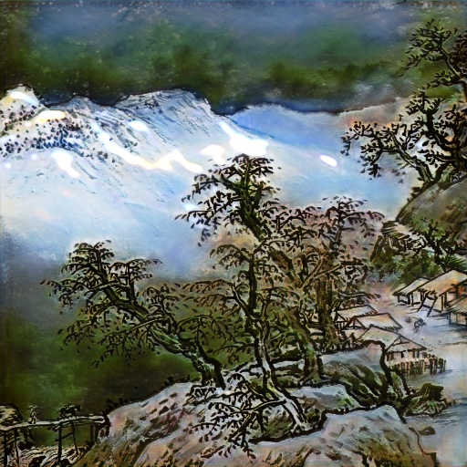
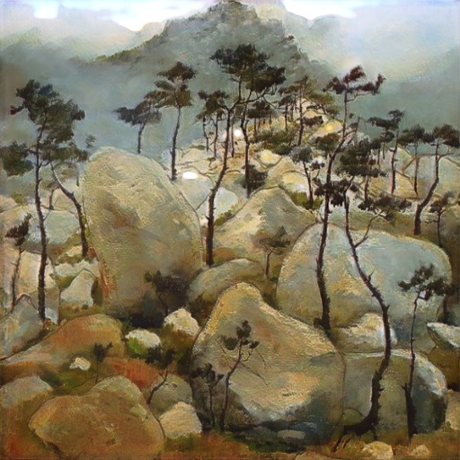

# *Refreshing of the Past — Chinese ancient painting style transfer*
By Kehan Xu, Minyan Wu, Jiangong Zhang

Task: Chinese traditional painting to real photos  

## Introduction
Aiming at the traditional painting transfer to real photos problem, we provide Tensorflow model based on CycleGAN adding three additional losses to improve the performance, which are identity loss, ink loss and content loss respectively.  
### painting to photos(scene dataset)

|input|CycleGAN+L(id)+L(ink)|CycleGAN+L(id)+L(ink)+L(con)|
|---|----|-----|
|| | |
|| | |
|| | |

## Model Details
### Identity loss  
preserve the color of the input painting  

### Ink loss  
fade unnecessary textures by training D_y and G between erosion-blur image(G(x)) and y  

|orginal|erode|blur|
|---|----|-----|
|| | |

### Content loss  
use vgg19 to extract image feature then constraint the constent between the input and the generate image: G(y)--y,F(x)--x  

### Train/Test
- Prepare dataset:
```bash
git clone https://github.com/l2yao/ChinesePaintingDataset.git  
mv ChinesePaintingDataset/content_images/others/ ChinesePaintingDataset/content_images/main/
```
- To view training results and loss plots, run `sh tb.sh` and click the URL http://localhost:6009.
- Train the model:
```bash
sh rtrain.sh
```
- Test the model:
```bash
python test.py

```
## Demo 

## Dataset
We use the dataset from *Neural abstract style transfer for Chinese traditional painting*. 

The content images are mostly the photorealistic scenes of mountain, lake, river, bridge, and buildings in regions south of the Yangtze River. It includes not only the scenes of China, but also beautiful pictures of Rhine, Alps, Yellow Stone, Grand Canyon, etc. 


## Reference
* [Unpaired Image-to-Image Translation using Cycle-Consistent Adversarial Networks](https://arxiv.org/pdf/1703.10593.pdf) - J. Zhu et al., ICCV2017.
* [ChipGAN: A Generative Adversarial Network for Chinese Ink Wash Painting Style Transfer](http://alumni.media.mit.edu/~shiboxin/files/He_MM18.pdf) - B. Hi et al., MM2018.
* [Neural abstract style transfer for Chinese traditional painting](https://arxiv.org/pdf/1812.03264.pdf) - B. Li et al., ACCV2018.
